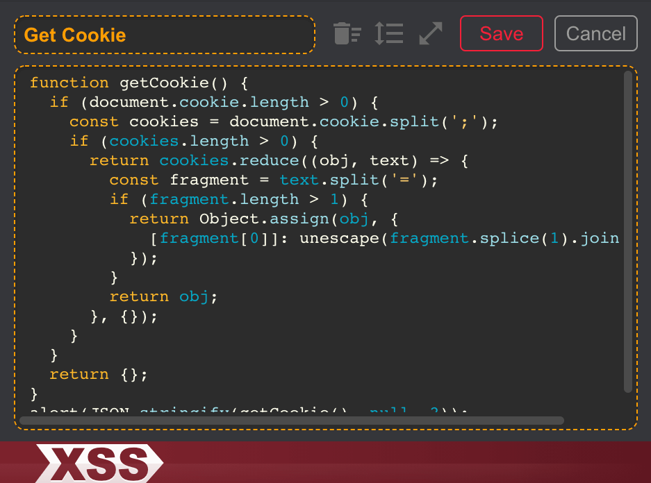
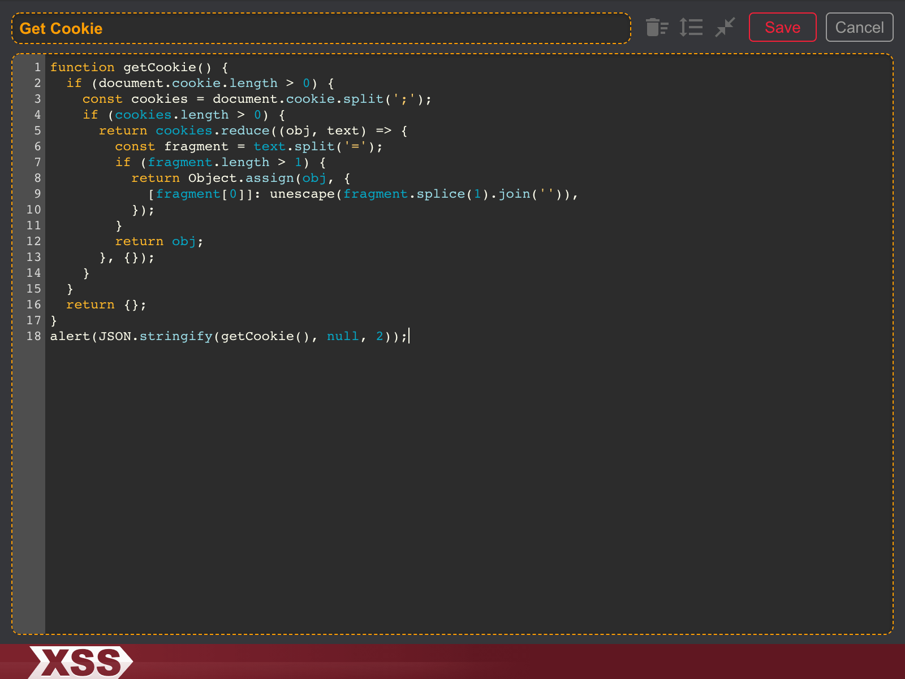
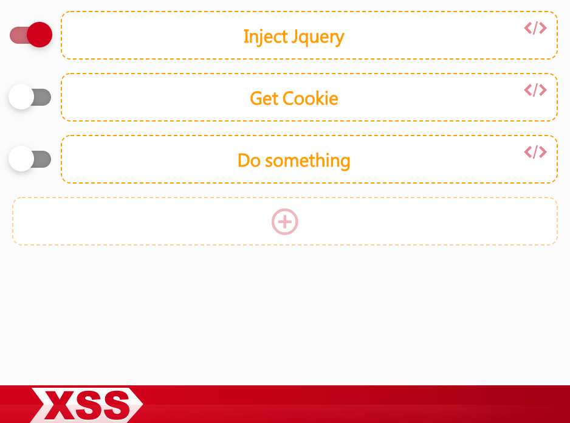
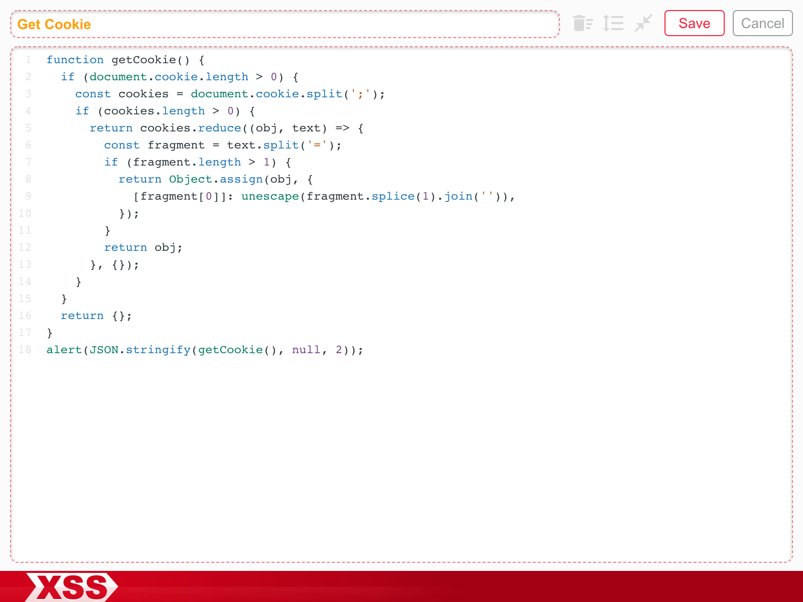
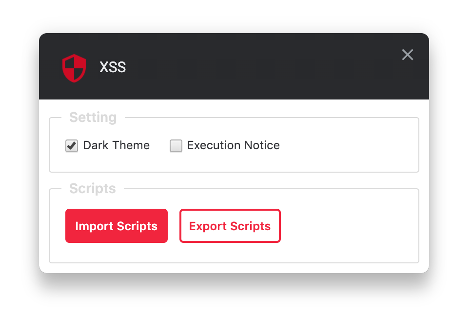

Claro, aqui está a tradução para o português:


[](/LICENSE)
[](/actions/workflows/main.yml)

## Introdução

Esta é uma ferramenta de extensão do Chrome que permite injetar `Scripts` personalizados na página da web atual. Por exemplo, você pode carregar o JQuery na página para facilitar a manipulação do DOM, ou ler informações de cookies, ou qualquer outro script JS que você queira executar, para facilitar testes ou depuração de desenvolvimento.

## Instalação da Extensão

Instale a partir da [Chrome Web Store](https://chrome.google.com/webstore/detail/xss/bebjbdbgpmgdlfehkibnmgmbkcniaeij)

## Execução Automática

A versão v1.1.0 adicionou a funcionalidade de Execução Automática. Depois de ativar o estado de Execução Automática, os scripts serão executados diretamente no início ao recarregar a página, o que é conveniente para executar tarefas que precisam ser executadas no início, como usar [Polly.js](https://netflix.github.io/pollyjs/) para lidar com o comportamento de API simulada. No entanto, você deve prestar atenção para que o script que você escrever não cause um loop infinito de recarregamento da página.

```javascript
// Por exemplo, este script continuará recarregando a página após a ativação da Execução Automática
location.reload();
```

## Extensão




## Tema

Clique com o botão direito no pequeno ícone da extensão e selecione `Opções` para desativar o `Tema Escuro` e usar o `Tema Claro`.




## Exportar e Importar Scripts

Clique com o botão direito no pequeno ícone da extensão e selecione `Exportar Scripts` para baixar todos os scripts atuais como `scripts.json`. Você também pode arrastar o arquivo `scripts.json` para a interface da janela aberta do XSS ou importar registros de scripts por meio da função `Opções`.

## Opções



## Dica

A extensão usa um closure ao injetar o script, então as variáveis não poluirão a janela. Se você precisar obter parâmetros de nível global, pode usar explicitamente window ou this.

```javascript
console.log(this === window); // true
```
